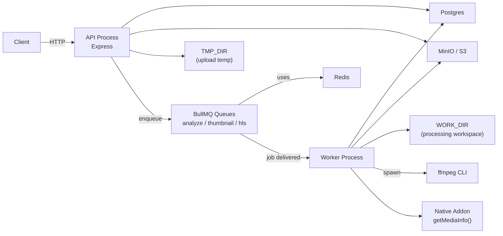
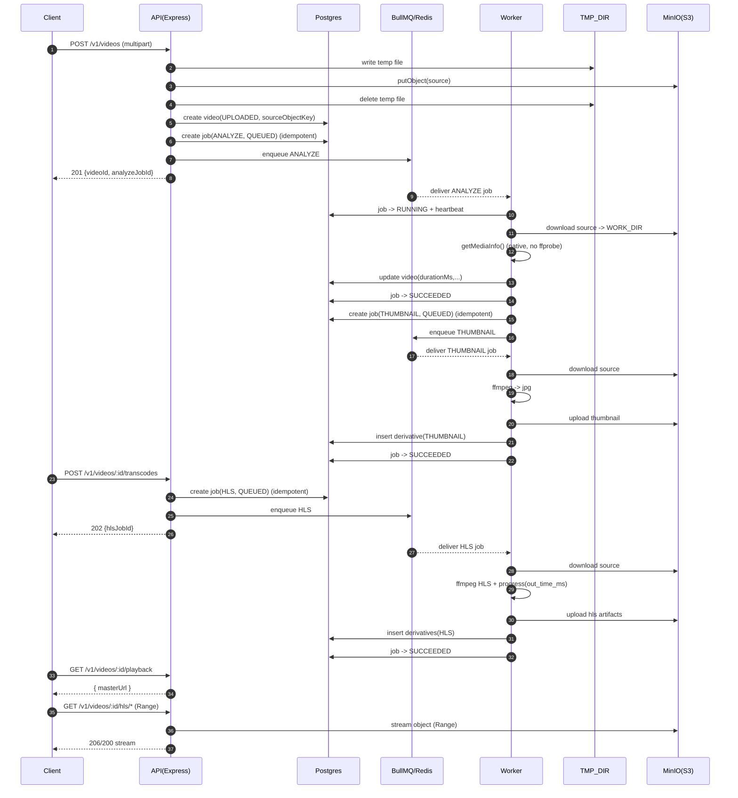
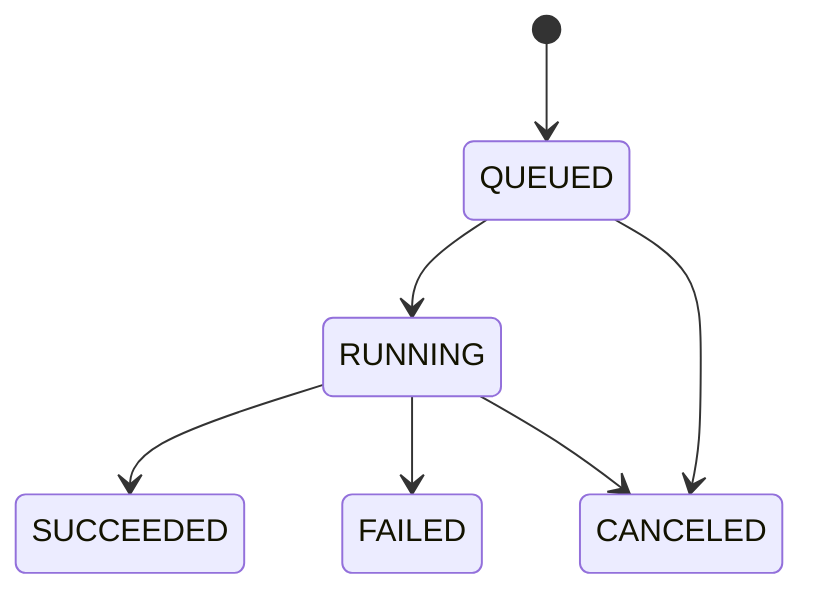

# 목표 아키텍처

## 1. 한 줄 요약

API 프로세스와 Worker 프로세스를 분리하고, **DB(Postgres)를 트루스 소스**, **큐(BullMQ/Redis)를 비동기 파이프라인**, **스토리지(MinIO/S3)를 파일 저장소**로 사용한다. 모든 요청은 v1 계약으로 고정한다.

## 2. 컨테이너/프로세스 다이어그램

## 3. 권장 디렉토리

- Entrypoints
  - `src/app.js` : Express app 구성(미들웨어/라우트 mount)
  - `src/server.js` : listen만 담당(API role)
  - `src/worker.js` : 큐 consumer 부팅(worker role)

- API Layer
  - `src/routes/v1/*Routes.js` : 라우팅/미들웨어 체인 정의
  - `src/controllers/*Controller.js` : HTTP ↔ 도메인 변환
  - `src/validators/*` + `src/middlewares/validate.js` : 입력 검증(zod)
  - `src/middlewares/errorHandler.js` : 에러 응답 통일
  - `src/middlewares/authenticate.js` : JWT 인증

- Domain/Service
  - `src/services/*Service.js` : 유스케이스(업로드/잡 생성/취소/조회)
  - (선택) `src/repos/*` : DB 접근을 분리하고 싶으면 repo 계층 추가

- Infra
  - `src/db/prisma.js`
  - `src/infra/redis.js` (BullMQ 포함)
  - `src/storage/storage.js`, `src/storage/s3Storage.js`
  - `src/infra/logger.js`, `src/middlewares/requestId.js`
  - `src/infra/metrics.js`

## 4. 핵심 데이터 모델 요약

- `users`: email unique, password hash
- `videos`: ownerId, status, sourceObjectKey, durationMs(NULL 가능), 메타
- `jobs`: type(ANALYZE/THUMBNAIL/HLS), status, progress/outTimeMs, heartbeat, attempts, queueJobId
- `derivatives`: THUMBNAIL/HLS 산출물 objectKey 및 메타

### 중복 방지

- `videoId + type`에 대해 `QUEUED/RUNNING` 중복을 막는 **Partial Unique Index**
- 서비스 로직은 **idempotent**: 같은 요청이 와도 같은 jobId를 반환(가능하면)

## 5. End-to-End 시퀀스

## 6. Job 상태 머신

## 7. API 계약

- 버저닝: `/v1`
- 입력 검증: zod로 params/query/body 전부 검증
- 에러 응답 통일: `{ code, message, details? }`
  - 대표 code: VALIDATION_ERROR, UNAUTHORIZED, FORBIDDEN, NOT_FOUND, CONFLICT, INTERNAL

- 인증/인가:
  - JWT 인증
  - ownerId 기반 접근 제어(비디오/잡/파생물 모두)

- 업로드 보안:
  - MIME sniffing(확장자 신뢰 금지)
  - 파일 크기 제한 강제
  - 파일명 sanitize(원본명은 DB만)

- 경로 안전:
  - 클라이언트가 `inputPath/outputPath/objectKey` 같은 값을 전달하는 API는 금지

## 8. 운영/관측성

- `/health`: role(api/worker) + uptime + db/redis ping(짧은 timeout)
- structured logging: requestId 전파 + 키 고정(`requestId,userId,videoId,jobId,queueJobId`)
- `/metrics`: job 성공/실패/재시도, 처리시간, 큐 길이 등